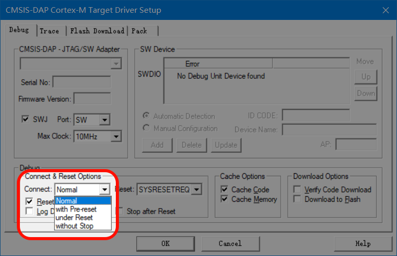
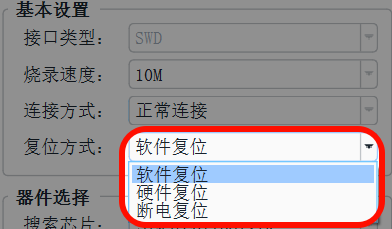

# DAPLink上位机

> **交流反馈QQ群：832486982**

## 软件介绍

> **1. 上位机支持的型号，本店所有脱机烧录器均支持脱机烧录！**
> 
> **2. 电压调节、断上电复位、选项字节等功能，需搭配本店硬件使用！**

**DAPLinkUtility**是一款通用DAPLink调试器上位机，用于嵌入式单片机开发者在项目开发调试阶段，在线读写MCU固件使用。支持自由读取、支持选项字节可视化配置。

软件功能沿用Keil的操作习惯，包括：烧录速度、连接方式、复位方式、一键烧录(F8)、烧录设置等。

## 支持芯片

支持30+芯片厂商的读取烧录支持，本软件采用的解析pack包中的FLM算法文件方式实现，所以理论上只要是keil能够烧录，本软件就可以读取烧录。目前一直在不断更新中。

## 选项字节

> **注意：此功能需搭配本店硬件使用。**

软件支持选项字节可视化配置，方便开发者对选项字节进行读保护、写保护、用户字节配置等。国产芯片的选项字节配置目前也在持续更新中。

## 功能介绍

### 常用芯片

软件支持将频繁使用的芯片添加至常用列表，省去切换芯片时来回搜索或查找芯片的麻烦。

 

### 连接方式和复位方式

arm和keil官方介绍：[https://developer.arm.com/documentation/101451/0100/Configure-Debugger-Driver/Configure-for-Debugging/Debug?lang=en](https://developer.arm.com/documentation/101451/0100/Configure-Debugger-Driver/Configure-for-Debugging/Debug?lang=en)

#### 连接方式

 

此功能对应KEIL中的Connect选项：

 

最常用的三种选项：

- Normal：正常连接
- with Pre-reset：预先复位
- under Reset：保持复位

各个选项功能如下：

- **正常连接：** 
    - 无操作
- **预先复位：** 
    - 连接芯片前硬件复位一次，该功能需要接RESET线。该功能常用于目标芯片的SWD接口被程序占用时、或芯片进入低功耗模式，导致无法二次烧录程序使用。
- **保持复位：** 
    - 在芯片复位状态下连接上芯片并暂停程序运行，该功能需要接RESET线。该功能常用于目标芯片的SWD接口被程序占用时、或芯片进入低功耗模式，导致无法二次烧录程序使用；或需要对芯片进行解密时，确保在解密过程中不受程序影响时使用。
- **上电复位：** 
    - **高级功能，仅本店硬件可用。** 连接芯片前断电复位一次，根据实际目标板调整断电延时时间和上电延时时间。此功能很有用，当SWDIO/SWCLK/RESET三个引脚同时被程序占用时，可以二次烧录程序。
  
上电复位的执行流程为：

1. 切断电源
2. 根据设置的断电延时时间进行延时
3. 打开供电 
4. 根据设置的上电延时时间进行延时尝试连接芯片，规定的尝试次数内未连上则显示连接失败。

> **注意：部分芯片在复位模式下无法连接芯片，所以只能使用预先复位的方式，如NRF、LN88X、RTL876X系列等。**

#### 复位方式

 

此功能对应KEIL中的Reset选项：

 

最常用的三种选项：

- Autodetect：自动选择复位方式
- SYSRESETREQ：软件复位
- HW RESET：硬件复位

> **tips①：** Keil对CMSIS-DAP调试器的支持有缺陷，所以当选择为'软件复位'时，并不会下发软件复位命令，程序下载完后不会运行，所以开发者常在CMSIS-DAP硬件上实现软复位。
> 
> **tips②：** 上位机拟补了此缺陷，当选择软件复位时，烧录完程序后将自动执行软件复位，无需接硬件RESET。

- **软件复位**
    - 烧录完程序后，自动执行一次软件复位
- **硬件复位**
    - 烧录完程序后，自动执行一次硬件复位
- **断电复位**
    - **高级功能，仅本店硬件可用。** 烧录完程序后，自动执行一次断电复位。断/上电延时的时间，通过高级选项(断电复位)控制。

#### ！！重要建议！！

由于市面上的DAPLink质量不一，经过我司技术人员对市面上各种DAPLink进行频繁、严格的测试后，总结出以下规律，为确保烧录过程中的将影响降低到最小，建议：

- 5线制接线时：Keil中复位方式选择HW RESET，对应上位机的硬件复位。（VCC、GND、SWDIO、SWCLK、RESET）
- 4线制接线时：Keil中复位方式选择SYSRESETREQ，对应上位机的软件复位。（VCC、GND、SWDIO、SWCLK）

