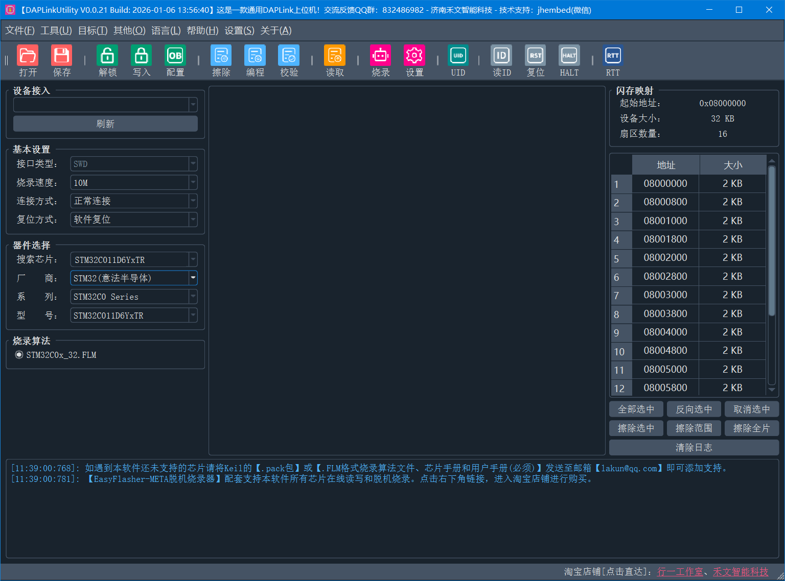
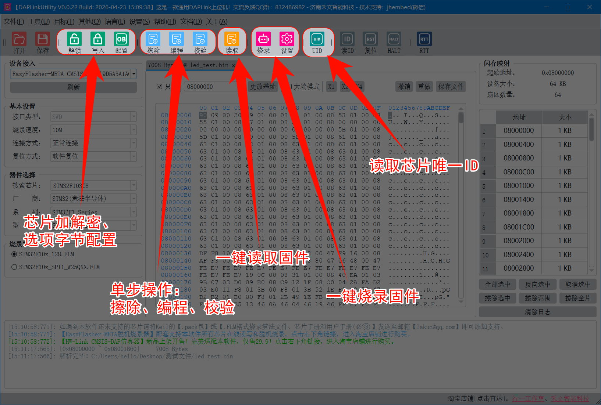
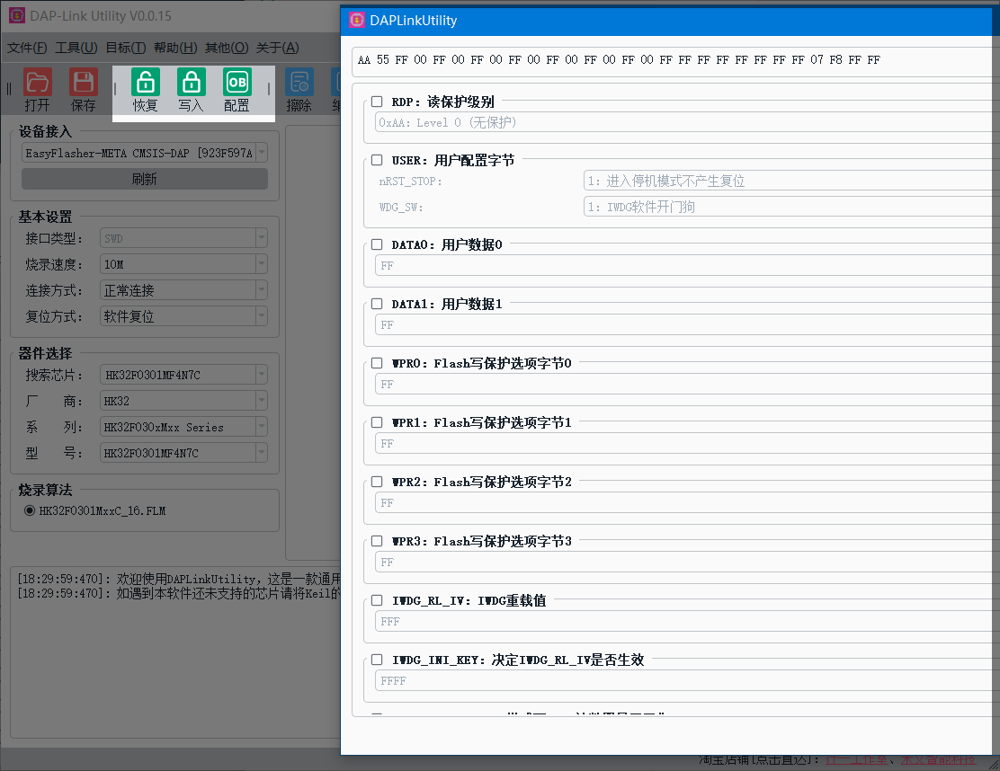
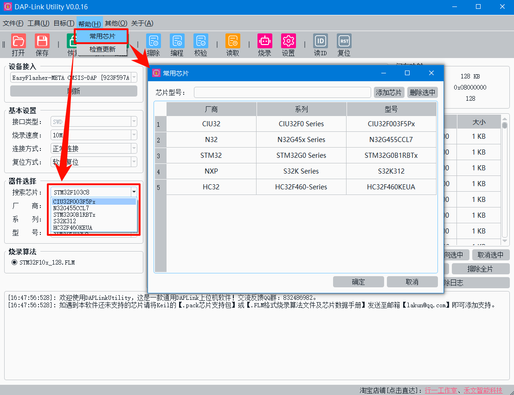
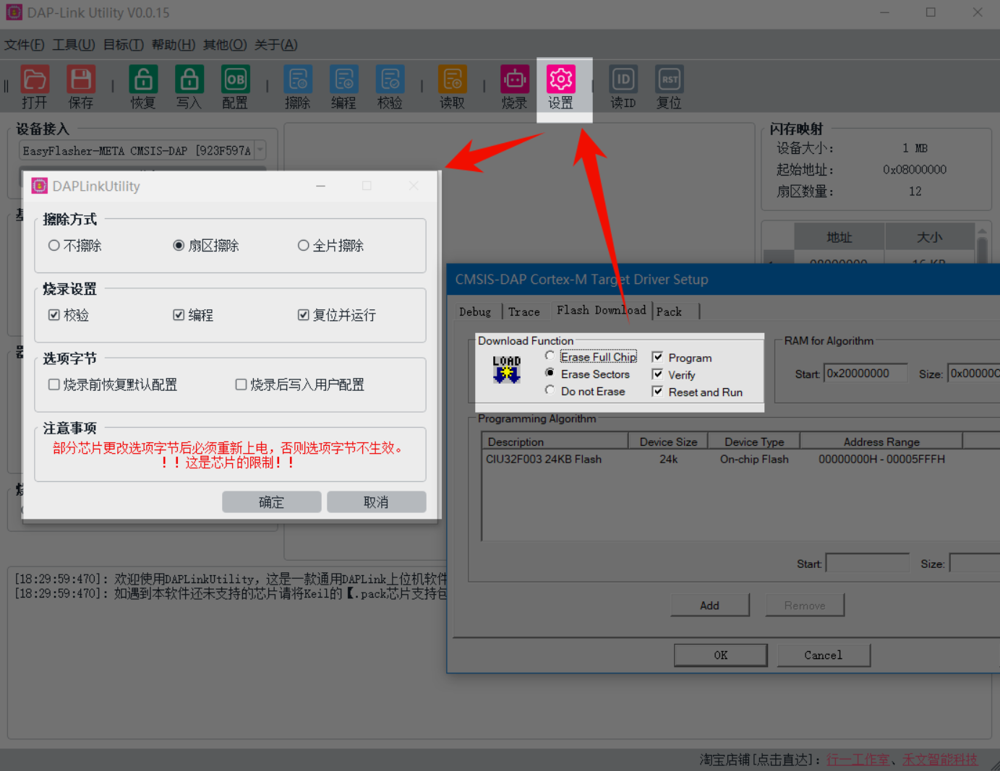
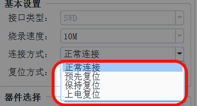
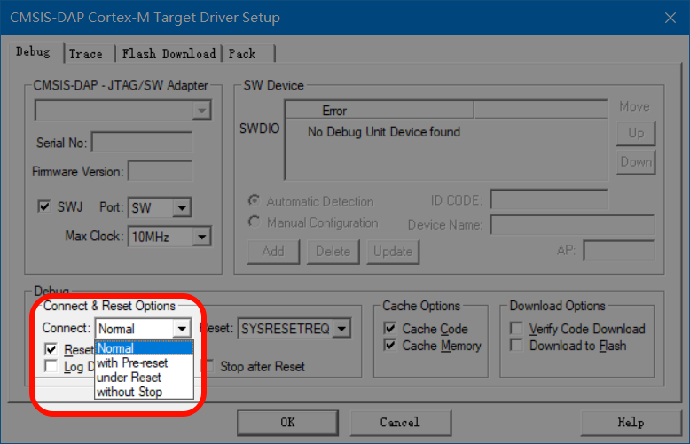
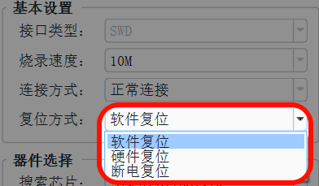
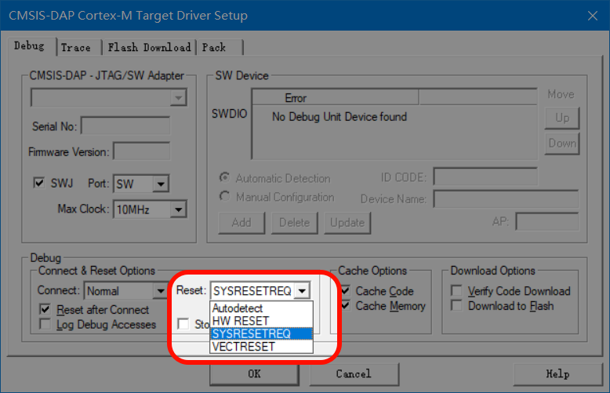

# DAPLink上位机

## 注意事项

> **交流反馈QQ群：832486982**

- 本软件支持的型号，本店硬件均支持**脱机烧录**
- V0.0.24版本是最后一版支持第三方DAPLink硬件
- V1.0.0版本之后的版本**只能使用本店硬件**
 
## 重要通知

**各位小伙伴，大家好！**

DAPLinkUtility 即将迎来重要的里程碑——从 V0.0.X 正式迈向 V1.X.X 时代。

**V0.0.24 将作为 V0 系列的收官之作，后续不再进行更新与维护。（PS：有时间还会优化BUG，但版本不在变更。）**

一路走来，我们深知烧录工具的开发与维护需要投入巨大的精力。为了让项目能够健康、长久地发展，仅靠“为爱发电”已难以支撑日益增长的研发成本。因此，出于可持续运营与专业化的考量，**一个月后 V0.0.X 版本将彻底关闭免费使用通道（后续还会不定期开放）**，此改变是由于众多第三方DAPLink使用者咨询使用问题，但不是我们的硬件，**并且出售该硬件的店铺内还未标明软件出处，在V0版本正常维护期间，我们承担了其他店铺的售后问题，造成客服售后压力巨大！**

**自 V1.0.0 起，软件将调整：仅支持配套官方硬件。**

这一改变是为了确保软硬件深度适配，从而为大家提供更稳定、更高效的使用体验。

与此同时，V1 版本将全面解锁更多专业级功能，包括：
- 🔧 **自定义 FLM 烧录算法：** 灵活支持各类非标 Flash 及外置存储芯片
- ✨ **RTT 控制台：** 让Segger RTT也能用上shell交互式控制台
- 📊 **JScope 功能：** 波形可视化分析
- 🏭 **量产烧录：** 支持单路/多路并行烧录，大幅提升生产效率

感谢大家长期以来对 DAPLinkUtility 的支持与包容。新的征程，期待与您继续同行！

2026年7月1日

## 软件下载

- 百度云网盘：[https://pan.baidu.com/s/5isepgphcrZYN0uN-tT0kIg](https://pan.baidu.com/s/5isepgphcrZYN0uN-tT0kIg)

## 软件介绍

**DAPLinkUtility** 是一款面向嵌入式单片机开发者的**通用型DAPLink调试器上位机软件**。旨在为项目开发、调试及量产阶段提供高效、便捷的在线读写与脱机烧录解决方案。

本软件采用底层协议驱动方式，并非打包了pyocd/openpcd，因此通用性极强！

软件采用解析Keil Pack包中FLM算法文件的机制，理论上只要是keil能够支持的芯片，本软件就能支持！

目前已适配50+芯片厂商，涵盖STM32、GD32、恩智浦S32K等主流及车规级MCU，并持续更新中。

功能上沿用了Keil的操作习惯，包括：烧录速度、连接方式、复位方式、一键烧录(F8)、烧录设置等。

## 选项字节

> **注意：此功能需搭配本店硬件使用。**

软件支持选项字节可视化配置，方便开发者对选项字节进行读保护、写保护、用户字节配置等。国产芯片的选项字节配置目前也在持续更新中。

## 功能介绍

### 常用芯片

软件支持将频繁使用的芯片添加至常用列表，省去切换芯片时来回搜索或查找芯片的麻烦。

 

### 烧录设置

### 连接方式和复位方式

arm和keil官方介绍：[https://developer.arm.com/documentation/101451/0100/Configure-Debugger-Driver/Configure-for-Debugging/Debug?lang=en](https://developer.arm.com/documentation/101451/0100/Configure-Debugger-Driver/Configure-for-Debugging/Debug?lang=en)

#### 连接方式

> **此功能对应KEIL中的Connect选项**

 

 

最常用的三种选项：

- Normal：正常连接
- with Pre-reset：预先复位
- under Reset：保持复位

各个选项功能如下：

- **正常连接：** 
    - 无操作
- **预先复位：** 
    - 连接芯片前硬件复位一次，该功能需要接RESET线。该功能常用于目标芯片的SWD接口被程序占用时、或芯片进入低功耗模式，导致无法二次烧录程序使用。
- **保持复位：** 
    - 在芯片复位状态下连接上芯片并暂停程序运行，该功能需要接RESET线。该功能常用于目标芯片的SWD接口被程序占用时、或芯片进入低功耗模式，导致无法二次烧录程序使用；或需要对芯片进行解密时，确保在解密过程中不受程序影响时使用。
- **上电复位：** 
    - **高级功能，仅本店硬件可用。** 连接芯片前断电复位一次，根据实际目标板调整断电延时时间和上电延时时间。此功能很有用，当SWDIO/SWCLK/RESET三个引脚同时被程序占用时，可以二次烧录程序。
  
上电复位的执行流程为：

1. 切断电源
2. 根据设置的断电延时时间进行延时
3. 打开供电 
4. 根据设置的上电延时时间进行延时尝试连接芯片，规定的尝试次数内未连上则显示连接失败。

> **注意：部分芯片在复位模式下无法连接芯片，所以只能使用预先复位的方式，如NRF、LN88X、RTL876X系列等。**

#### 复位方式

> **此功能对应KEIL中的Reset选项**

 

 

最常用的三种选项：

- Autodetect：自动选择复位方式
- SYSRESETREQ：软件复位
- HW RESET：硬件复位

> **tips①：** Keil对CMSIS-DAP调试器的支持有缺陷，所以当选择为'软件复位'时，并不会下发软件复位命令，程序下载完后不会运行，所以开发者常在CMSIS-DAP硬件上实现软复位。
> 
> **tips②：** 上位机拟补了此缺陷，当选择软件复位时，烧录完程序后将自动执行软件复位，无需接硬件RESET。

- **软件复位**
    - 烧录完程序后，自动执行一次软件复位
- **硬件复位**
    - 烧录完程序后，自动执行一次硬件复位
- **断电复位**
    - **高级功能，仅本店硬件可用。** 烧录完程序后，自动执行一次断电复位。断/上电延时的时间，通过高级选项(断电复位)控制。
- **禁用复位**
    - 下载完程序后不自动执行复位，ARM官方DAPLink为此选项。（*注：设置为该模式后，当使用keil下载完程序后，程序不会自动运行，需要手动复位或者将板子重新上电。*）
  
#### ！！重要建议！！

由于市面上的DAPLink质量不一，经过我司技术人员对市面上各种DAPLink进行频繁、严格的测试后，总结出以下规律，为确保烧录过程中的将影响降低到最小，建议：

- 5线制接线时：Keil中复位方式选择HW RESET，对应上位机的硬件复位。（VCC、GND、SWDIO、SWCLK、RESET）
- 4线制接线时：Keil中复位方式选择SYSRESETREQ，对应上位机的软件复位。（VCC、GND、SWDIO、SWCLK）

