# EasyFlasher-META脱机烧录器用户使用指南

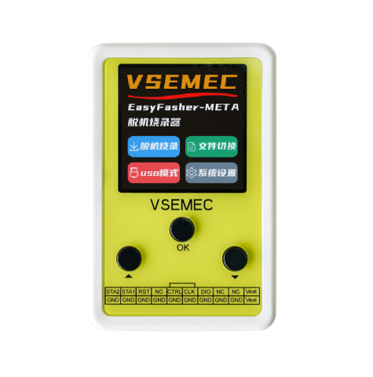

## 购买链接

**点击以下链接，或手机淘宝APP扫一扫二维码。**

| 行一工作室 | 禾文智能科技 |
| :--------: | :--------: |
| [https://item.taobao.com/item.htm?id=899498306572](https://item.taobao.com/item.htm?id=899498306572) | [https://item.taobao.com/item.htm?id=909368817574](https://item.taobao.com/item.htm?id=909368817574) |
|  |  |

## 支持型号

[点此查询支持的型号](https://www.vsemec.com/page-87917.html)

## 资料下载

- 配套上位机软件：
    - 蓝奏云网盘：[https://wwwq.lanzouu.com/b0kobqich](https://wwwq.lanzouu.com/b0kobqich)，提取码：5lxi
    - 百度云网盘：[https://pan.baidu.com/s/1FE3pROvqj5ic1aEpv0OvqA?pwd=1234](https://pan.baidu.com/s/1FE3pROvqj5ic1aEpv0OvqA?pwd=1234)，提取码: 1234

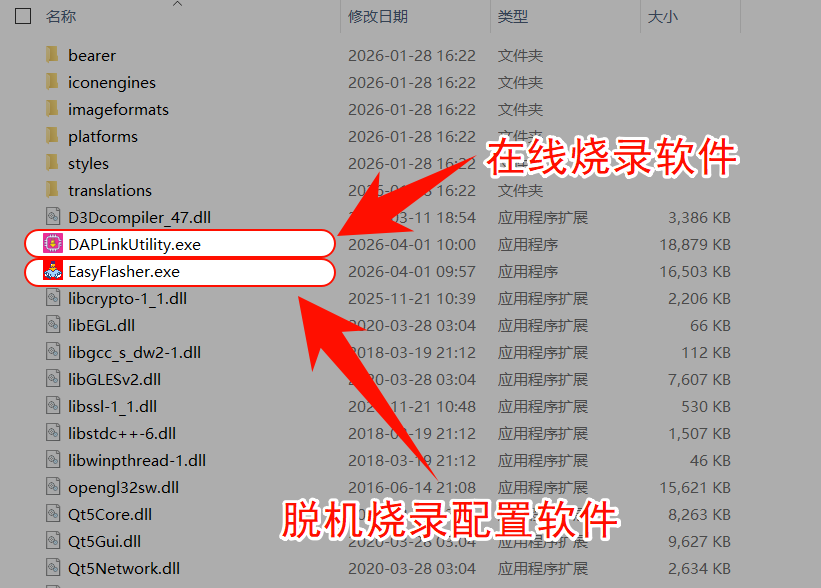

## 文档修订历史

| 版本 | 日期          | 修订人 | 说明                                  |     |
| :--- | :------------ | :----- | :------------------------------------ | --- |
| V1.0 | 2025年3月13日 | -      | 出版发布                              |     |
| V1.1 | 2025年5月24日 | -      | 1.增加在线烧录章节 2.更新功能说明 |     |
| V1.2 | 2025年8月16日 | -      | 修订新版META使用说明                  |     |
| V1.3 | 2025年9月9日  | -      | 新增连接模式：上电复位模式说明        |     |
| V1.4 | 2025年12月5日 | -      | 增加Keil中Reset复位方式使用说明       |     |
| V1.5 | 2026年1月6日  | -      | 增加**硬件设置**说明                  |     |
| V1.6 | 2026年3月2日  | -      | 更新设备界面图片                      |     |

## 产品简介

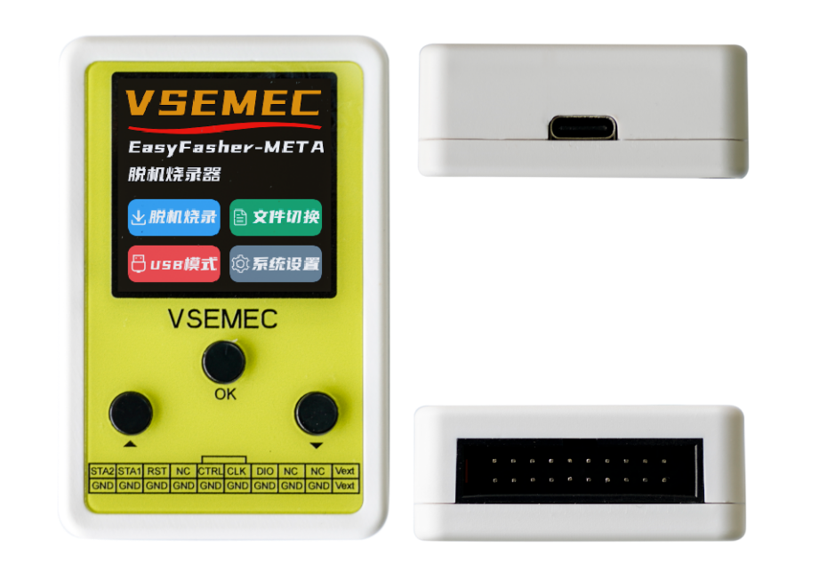

- 外形尺寸：70x45x18mm
- 屏幕尺寸：1.54寸TFT彩屏（240x240分辨率）
- 烧录接口：SWD
- 工作电压：DC 5V (USB-Type C供电)
- 工作电流：50~300mA@5V
- 工作温度：-20℃~70℃

## 功能特点
- 超万种芯片支持，配套在线读写烧录软件，工程师的好帮手！
- 持续增加新芯片支持，永久免费升级固件；
- 支持选项字节可视化配置；
- 支持多固件存储，支持镜像切换；
- 支持限制烧录次数
- 支持滚码写入；
- 支持自动连续烧录；
- 支持输出1.8V/3.3V/5V电压可调；
- 支持低功耗模式下或SWD口被占用时的目标芯片烧录，烧录前自动复位目标芯片；
- 支持脱机文件与烧录器绑定，生成的脱机文件多重加密，保证用户固件安全；
- SWD协议深度优化，烧录速度超快；
- 在线调试、脱机烧录二合一，支持KEIL、IAR等软件的在线烧录、调试、仿真；
- 防反接保护，防止因操作不当烧坏烧录器

## 固件升级

> 当前最新固件版本：V3.0.3。

固件升级：

1. 将烧录器切换至USB模式
2. 打开EasyFlasher上位机软件->帮助->固件升级

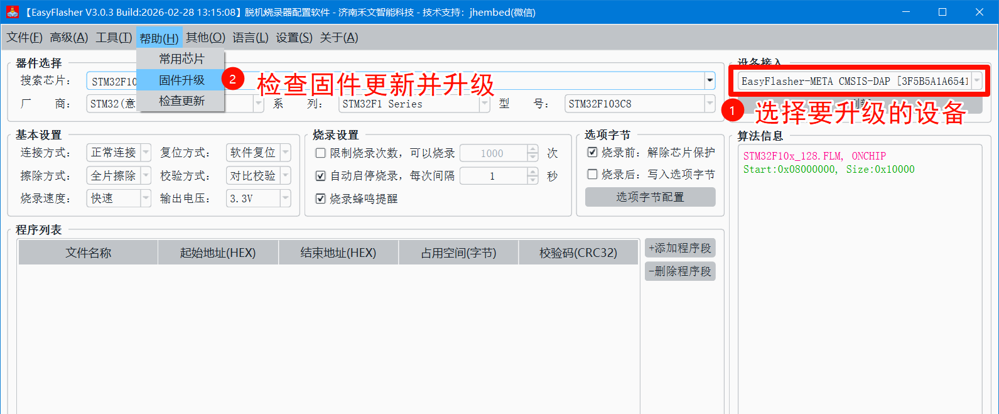

## 接线说明

### 接线示例

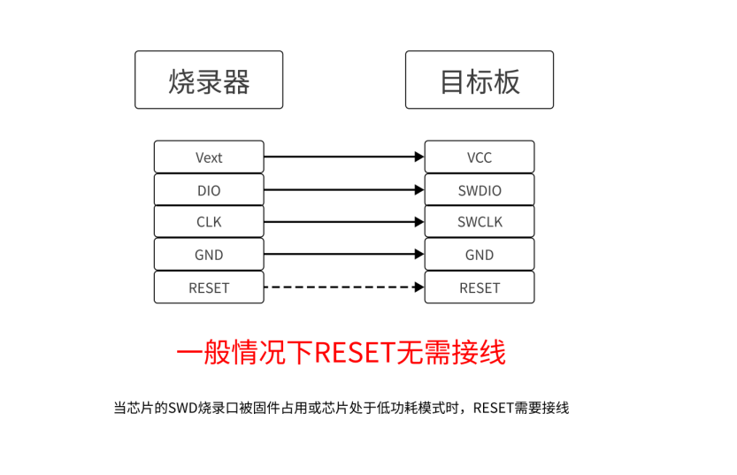

### 引脚定义

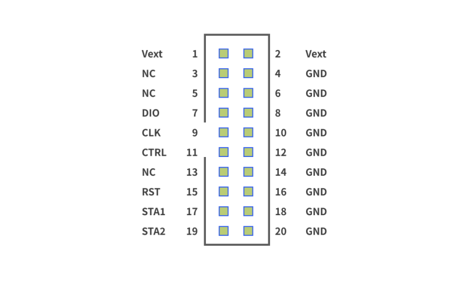

### 机台信号控制

- CTRL：外部烧录控制，拉低50ms触发一次烧录
- STA1：烧录状态，高电平表示空闲，低电平表示正在烧录
- STA2：烧录结果，高电平表示烧录成功，低电平表示烧录失败

控制时序如下图所示：

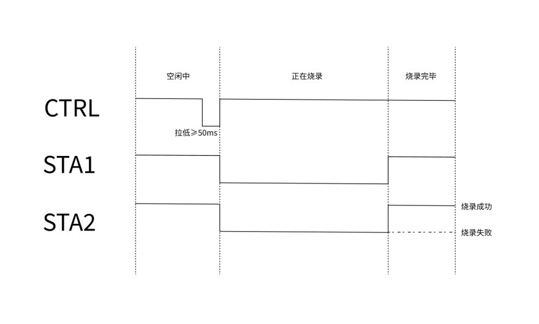

## 设备界面展示

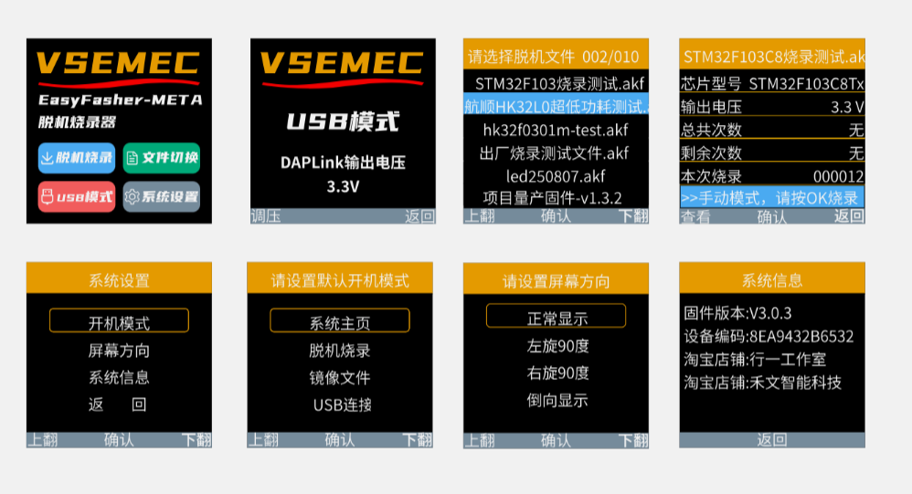

## 脱机烧录配置软件功能说明

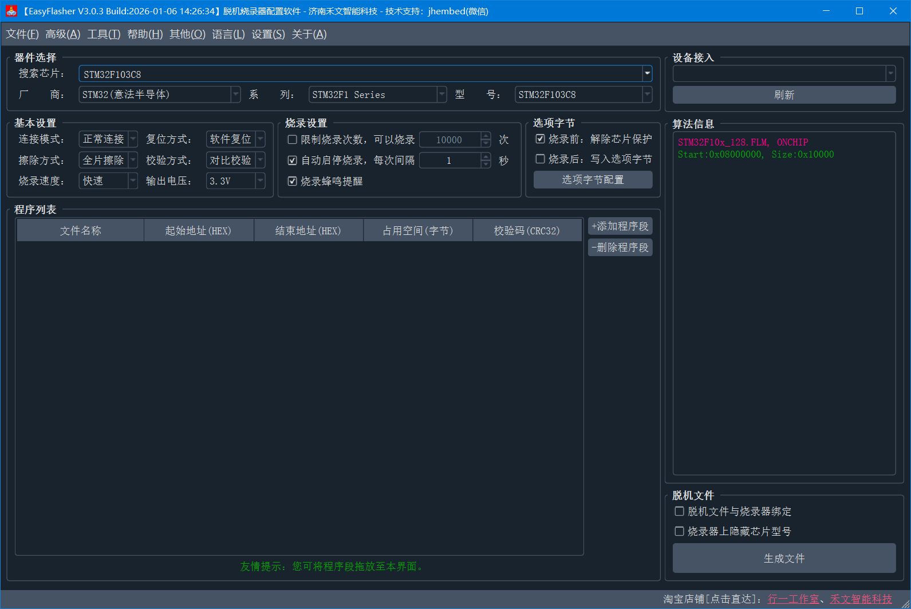

见《[脱机烧录配置软件功能说明](../EasyFlasher/index.md)》

## 脱机烧录

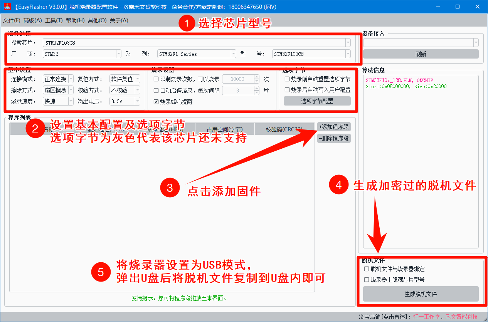

脱机烧录器在使用脱机烧录时，需使用配置软件生成.AKF格式的脱机文件。生成脱机文件的具体步骤如下：

1. 选型实际使用的芯片型号；
2. 进行基础设置，如连接方式、擦除方式、选项字节等；
3. 点击【添加程序段】按钮将.bin或者.hex格式的固件文件添加至上位机内；
4. 点击【生成脱机文件】按钮将.afk格式的脱机文件保存至电脑硬盘或直接保存至烧录器U盘内。
5. 将烧录器切换为【USB模式】，烧录器显示界面如下图所示，切换后电脑上弹出U盘，将脱机文件复制到此U盘内即可。

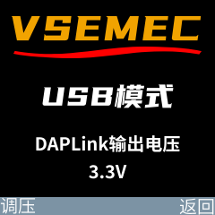

## 在线烧写

> 注意：当使用【**外部输入**】模式时，外部供电电压支持3.3~5V，请勿超压供电！

将烧录器切换至【USB模式】，并提供DAPLink调试器功能。

可搭配我司上位机软件**DAPLinkUtility**对目标芯片在线读取、烧录、配置选项字节，解锁芯片等。

DAPLinkUtility使用说明，见《[DAPLink上位机](../DAPLinkUtility/index.md)》。

## Keil在线仿真调试

### Keil配置

见《[Keil中使用DAPLink常用设置](../other/daplink_keil_settings.md)》。

### 驱动安装

见《[驱动安装](../other/daplink_driver_install.md)》。

### 常见问题

见《[Keil中使用DAPLink常见问题](../other/daplink_keil_FAQ.md)》。

## 硬件设置（个性化功能）

> 注意：此功能需要烧录器固件版本≥V3.0.3。请检查更新固件并升级：菜单->帮助->固件升级。

见《[硬件设置](../other/hardware_settings.md)》。
