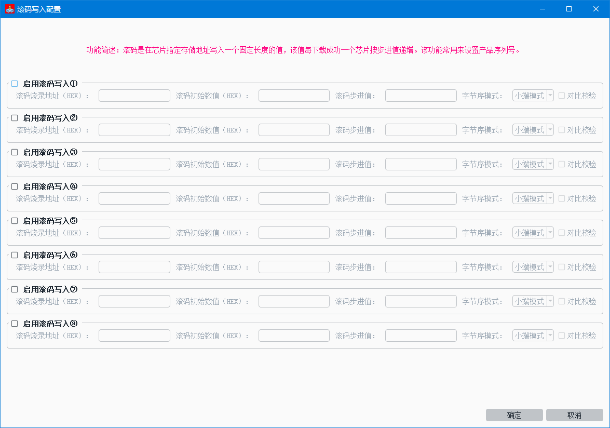
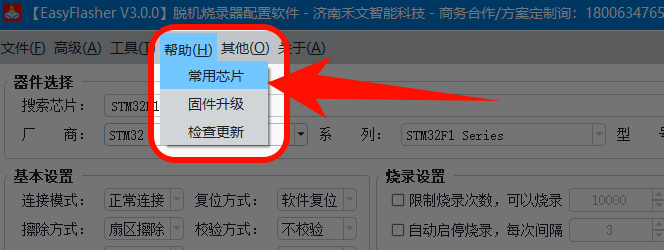
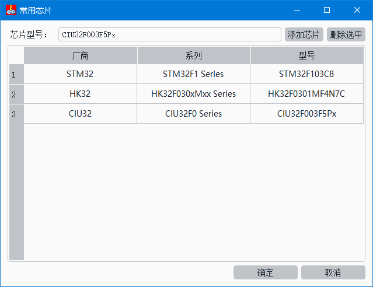
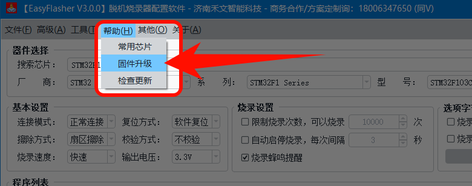

# EasyFlasher脱机烧录配置软件

### 软件下载

- 蓝奏云网盘：[https://wwwq.lanzouu.com/b0kobqich](https://wwwq.lanzouu.com/b0kobqich)，提取码：5lxi

- 百度云网盘：[https://pan.baidu.com/s/1FE3pROvqj5ic1aEpv0OvqA?pwd=1234](https://pan.baidu.com/s/1FE3pROvqj5ic1aEpv0OvqA?pwd=1234)，提取码: 1234

### 基本设置

#### 程序列表

配置软件支持添加多个程序段，生成后的脱机文件自动合并为一个完整脱机文件，常见于包括一个BOOT程序+一个APP程序组合成一个完整固件的使用场景。

支持添加HEX格式和BIN格式的固件程序，添加HEX格式时配置软件自动识别FLASH的烧录地址，BIN格式需要手动指定烧录地址。

大多数单片机如STM32、GD32、MM32等厂家单片机的FLASH起始地址为0x08000000，国产华大HC32、武汉芯源CW32等厂家单片机的FLASH起始地址为0x00000000。

#### 连接模式

- **正常连接**
    - 烧录时通过SWD读取目标芯片的IDCODE来识别芯片是否存在。
- **预先复位**
    - 连接芯片前硬件复位一次，该功能需要接复位线。该功能常用于目标芯片的SWD接口被程序占用时、或芯片进入低功耗模式，导致无法二次烧录程序。
- **保持复位**
    - 在芯片复位状态下连接上芯片并暂停程序运行，该功能需要接复位线。该功能常用于目标芯片的SWD接口被程序占用时、或芯片进入低功耗模式，导致无法二次烧录程序。
    - > 注意：部分芯片在复位模式下无法连接芯片，所以只能使用预先复位的方式，如NRF、LN88X、RTL876X系列等。
- **上电复位**
    - 连接芯片前断电复位一次，根据实际目标板调整断电延时时间和上电延时时间。**此功能很有用，当SWDIO/SWCLK/RESET三个引脚同时被程序占用时，可以二次烧录程序**。

烧录器上电复位的执行流程为：

1. 切断电源
2. 根据设置的断电延时时间进行延时
3. 打开供电
4. 根据设置的上电延时时间进行延时
5. 尝试连接芯片，规定的尝试次数内未连上则显示连接失败

#### 复位方式

芯片的复位方式，可选择为：软件复位、硬件复位。

#### 擦除方式

对目标单片机烧录程序时FLASH的擦除方式，可选择全片擦除和扇区擦除（按需擦除）。

低于512K FLASH容量以下的单片机建议使用全片擦除，因为这类型的单片机全片擦除很快。

高于512K FLASH容量的建议选择扇区擦除，这一类型的单片机如STM32F4系列，1M的FLASH全片擦除需要接近20秒，全片擦除较慢，所以选择扇区擦除。

#### 校验方式

启用烧录过程中对固件的对比校验。

#### 选项字节

支持烧录前自动重置芯片选项字节或解锁芯片、烧录固件完毕后自动写入用户配置的选项字节。

> 注意：**更改选项字节或解除芯片保护后需要重新上电才会生效，这是芯片的限制。** 如果您是使用烧录器对目标单片机供电，那么烧录器会自动对目标单片机进行断电复位。

- 烧录前：解除芯片保护
    - 勾选后，在烧录前自动解除芯片保护。如果芯片已经开启了加密或者读保护，不解除是无法烧录程序的。
- 烧录后：写入选项字节
    - 勾选后，在烧录完后自动写入用户配置的选项字节信息
  

#### 自动烧录

开启或关闭自动启停烧录。

#### 烧录间隔

开启自动烧录时，一次烧录成功后等待几秒后开始下一次的烧录。（仅当自动烧录开启后该参数有用）。

#### 烧录速度

设置烧录时的速度，可选择高、中、低速，可依据实际使用环境进行选择。

如果在实际使用中发现频繁烧录失败，一般是由于下载速度过快，或者线上的干扰造成的，可切换中低速进行下载。

#### 烧录提醒

烧录时开启或关闭蜂鸣器提醒。

- 开启时：成功连接到目标板时响一声，烧录成功时快响2声，烧录失败时响4声。
- 关闭时：成功连接到目标板后一直慢响，烧录成功时快响2声，烧录失败时响4声。

#### 输出电压

选择给目标板的供电电压。可选择5V、3.3V、1.8V以及外部输入。

当选择外部输入时，由目标板给烧录器供电，供电电压为3.3~5V，此时请拔掉USB供电。

> 注意：外部输入给烧录器供电时，请注意供电能力是否足够。

### 脱机烧录

脱机烧录器在使用脱机烧录时，需使用配置软件生成.AKF格式的脱机文件。生成脱机文件的具体步骤如下：

1. 选型实际使用的芯片型号；
2. 进行基础设置，如连接方式、擦除方式、选项字节等；
3. 点击【添加程序段】按钮将.bin或者.hex格式的固件文件添加至上位机内；
4. 点击【生成脱机文件】按钮将.afk格式的脱机文件保存至电脑硬盘或直接保存至烧录器U盘内。
5. 将烧录器切换为【USB模式】，烧录器显示界面如下图所示，切换后电脑上弹出U盘，将脱机文件复制到此U盘内即可。

### 滚码烧录

支持8组滚码烧录，可在菜单栏->高级->滚码写入，进行启用。

### 选项字节

支持选项字节可视化配置，方便设置读保护、用户选项字节等配置。

支持烧录固件前自动将芯片的选项字节恢复成默认或解锁芯片。

支持烧录固件后将用户自己配置的选项字节写入。

> 注：若选项字节区域为灰色禁用状态，则该芯片的选项字节还未支持，请等待后续更新支持。

### 常用芯片

通过添加常用芯片，在搜索下拉框中进行芯片型号的快速选择，方便使用。

### 固件合并工具

软件内置固件合并工具，可以将多个程序段组成一个完整固件。常用于BOOT程序+APP程序进行合并的使用场景。

### HEX转BIN工具

配置软件内置了hex格式固件转bin格式固件工具，方便用户按需使用。

### 固件升级

将脱机烧录器插入电脑并切换为**【USB模式】**，在配置软件内依次点击：**菜单栏->帮助->固件升级**，对脱机烧录器进行固件程序升级.

升级过程中请勿断开USB连接，勿拔插电脑上的其他USB设备，以免影响烧录器的数据传输，耐心等待几分钟传输完成后，烧录器将自动更新重启。

### 软件更新

您也可以依次点击软件内：菜单栏->帮助->检查更新，检查更新是否有更细。

### 硬件设置

见《[硬件设置](../other/hardware_settings.md)》。

