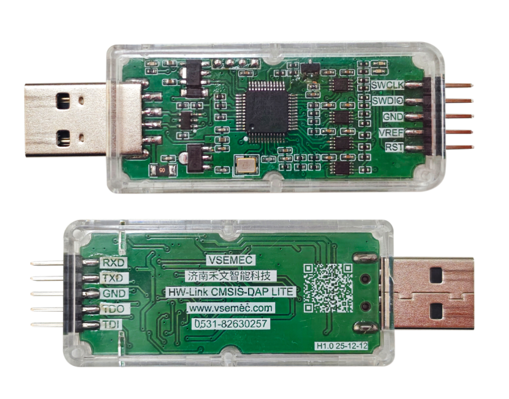
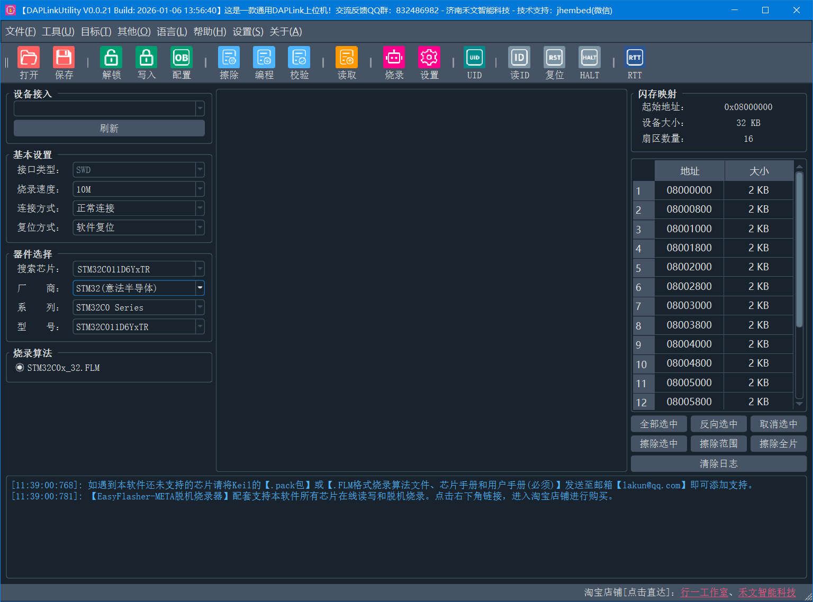
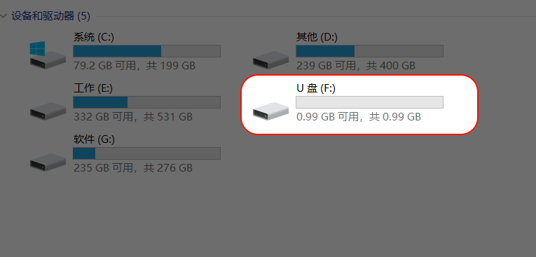

# HWLink CMSIS-DAP 仿真器

## 购买链接

**点击以下链接，或手机淘宝扫描下方二维码。**

| 行一工作室 | 禾文智能科技 |
| :--------: | :--------: |
| [https://item.taobao.com/item.htm?id=1044759725936](https://item.taobao.com/item.htm?id=1044759725936) | [https://item.taobao.com/item.htm?id=1043049619446](https://item.taobao.com/item.htm?id=1043049619446) |
|  |  |

## 产品简介

| 支持功能 | LITE版本 | META版 |
| :--------: | :------: | ------ |
| 烧录速度 |  5M   | 50M  |
| USB通讯速度 |  普速(USB2.0 12M)   | 高速(USB2.0 480M)  |
| 电压调节 |  0/3.3/5V   | 0/3.3/5V  |
| 支持接口 |  SWD/JTAG/CDC/UART   | SWD/JTAG/CDC/UART  |
| 通讯方式 |  HID+WINUSB   | HID+WINUSB  |
| 反向供电 |  不支持   | 不支持  |

 
> **💡 META版本的实际物理速度 = 设置速度 X 5。例如在使用Keil时，设置速度为1M，实际物理速度为5M，最高支持50M。**

## 配套上位机

- 配套在线读写烧录软件，国产芯片全搞定！
- 外部输入参考电压/3.3V/5V电压可调！

当设置为**外部输入**时，电平电压根据目标板的参考电压自动调整为3.3V或5V。

## 固件升级

1. 将RESET与GND用杜邦线短接
2. 上电，此时电脑端枚举出一个0.99G的模拟U盘
    
3. 将`.ufw`格式的升级文件拖入虚拟U盘内
4. 等待升级完成
5. 取消RESET与GND之间的短接
6. 升级完成

HW-Link_LITE升级文件下载：[点击此处下载（v1.0.0）](https://gitee.com/jhembed/EasyFlasherUpdater/raw/main/HW-Link_LITE_v1.0.0.ufw)

## 硬件配置

见《[硬件设置](../other/hardware_settings.md)》。

## 驱动安装

见《[驱动安装](../other/daplink_driver_install.md)》。

## Keil配置

见《[Keil中使用DAPLink常用设置](../other/daplink_keil_settings.md)》。

## 常见问题

见《[Keil中使用DAPLink常见问题](../other/daplink_keil_FAQ.md)》。
