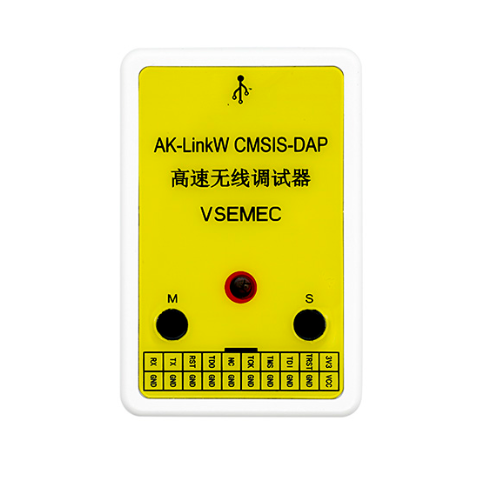
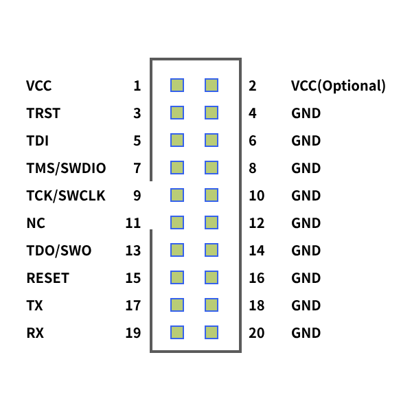

# AK-LinkW CMSIS-DAP 高速无线调试器

## 购买链接

- 点击直达①：[https://item.taobao.com/item.htm?id=904179490554](https://item.taobao.com/item.htm?&id=904179490554)
- 点击直达②：[https://item.taobao.com/item.htm?id=908364998010](https://item.taobao.com/item.htm?id=908364998010)

## 产品简介

- 外形尺寸：70x45x18mm（长x宽x高）
- 烧录接口：20P标准JTAG接口
- 工作电压：5V (USB Type-C 供电)
- 工作电流：50~500mA@5V
- 工作温度：-20℃~70℃
- 接口电平：3.3V

> **无线调试时，接收端支持由目标板给调试器供电，无需额外使用USB供电。**

## 产品展示

## 功能特点

- 硬件开源！个人玩家随意制作！
- ESP32S3高性能主控芯片，支持有线模式、无线模式双模，收发两端硬件完全一致；
- 有线下载速度100Kb/s，比ST-Link V2快两倍！
- 无线下载速度41Kb/s，与ST-Link V2有线速度几乎一致！
- 支持无线CDC虚拟串口，在线调试烧录与CDC同时使用互不影响；
- 支持低功耗模式下或SWD口被占用时，自动复位目标芯片；
- 无线信道自由切换，满足不同场景下的使用速率；
- 支持KEIL、IAR等软件的在线烧录、调试、仿真；
- USB防静电保护，防止烧坏电脑U口。

## 下载速度

> 测量是手动掐秒表计时，下载速度受芯片型号、线损、WIFI干扰等多方面的因素影响，以下测试速度仅供参考。

- 测试芯片：STM32F407VGT6
- 测试大小：1000Kb
- 测试软件：Keil-MDK
- 测试方式：扇区擦除+编程+校验

| 调试器类型     | 编程耗时  | 总耗时   | 理论下载速度   |
|:---------:|:-----:| ----- | -------- |
| STLink V2 | 23.XX | 37.XX | ≈43Kb/s  |
| S3无线模式    | 27.XX | 40.XX | ≈41Kb/s  |
| S3有线模式    | 10.XX | 24.XX | ≈100Kb/s |

## 引脚定义

- 标准20针JTAG座；
- 带虚拟CDC串口；
- 无线仿真、调试、CDC串口同时使用互不影响！
- VCC电压(2号脚)可通过主板上的拨码开关选择输出3.3V或5V。（出厂默认3.3V）

## 工作模式切换

> 模式设置只需设置一次，参数掉电不丢失。

RGB灯颜色指示说明：

- 红色：配置模式
- 绿灯：主机模式
- 蓝灯：无线模式-主机端
- 黄灯：无线模式-从机端

### 如何配置为有线模式？

1. 按住主机键和从机键
2. 上电
3. 等待RGB灯颜色变红灯
4. 松开所有按键
5. 等待RGB变绿灯
6. 设置完毕

### 如何配置为无线模式？

1. 按住发送端主机键后上电
2. 等待RGB变红灯
3. 松开按键
4. 按住接收端从机键后上电
5. 等待RGB变红灯
6. 松开按键
7. 等待自动配对完成(主机端亮蓝灯，从机端亮黄灯)
8. 设置完毕

### 无线模式无法配对？

检查信道是否一致，接收端与发送端只有在信道一致时，才能配对成功。

检查方法：

1. 调试器正常上电
2. 长按主机键3秒
3. 等待灯灭
4. 松开按键
5. RGB灯闪烁三下
6. 查看当前显示颜色

主机端和从机端的颜色如果不一致，请调整为一致，并重新尝试配对。

## 信道切换

七彩色：红、橙、黄、绿、青、蓝、紫，代表8~14区间的7个信道。

无线速率受WIFI信号干扰的影响，出厂默认14信道(紫色)，如果下载速度慢，请尝试更换其他信道。

更换信道步骤：

1. 正常上电
2. 长按主机键3秒
3. 等待灯灭
4. 松开按键
5. RGB灯闪烁三下
6. 单击**从机键**更换信道，七种颜色将循环显示
7. 重新上电后生效

## 配套上位机

