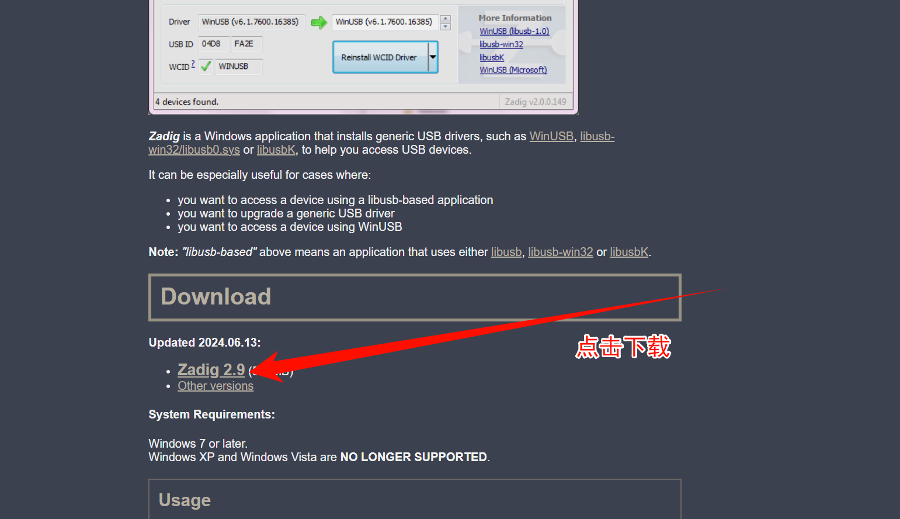
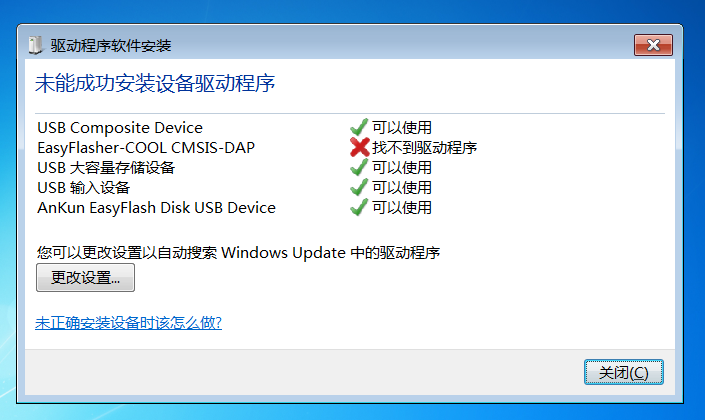
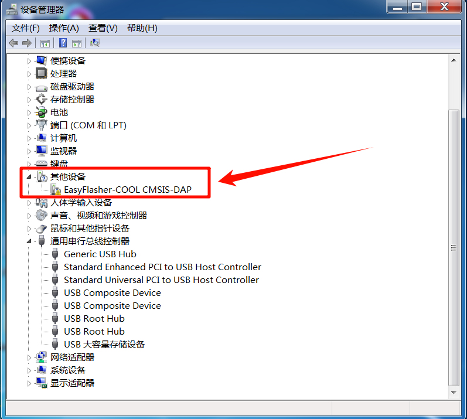
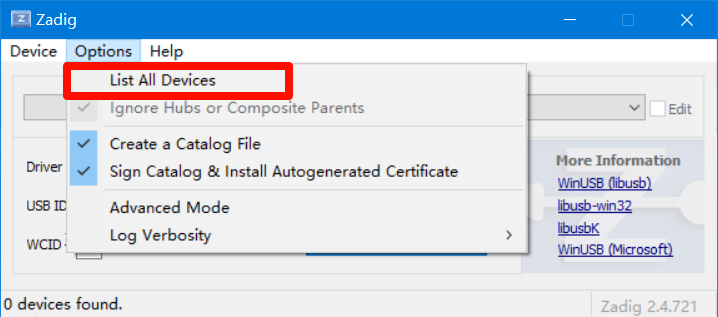
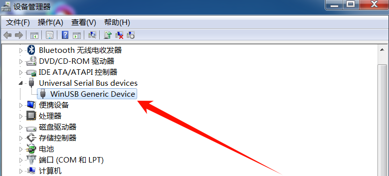

# DAPLink驱动安装

## 说明

本说明适用于所有DAPLink硬件。

目前市面上DAPLink分两种版本：

- V1：采用HID通信，完全免驱使用
- V2：采用WinUSB通信，速度更快，在早期win10、win7、win8系统上，需要安装驱动

## 驱动安装

> 驱动安装软件：**zadig.exe**
> 
> 官方下载地址：[https://zadig.akeo.ie/](https://zadig.akeo.ie/)
>
> 

将DAPLink插入Win7系统或低版本的Win10系统的电脑，系统提示未成功安装驱动，如下图所示：

设备管理器中多出一个带感叹号的设备，如下图所示：

打开**zadig.exe**软件，进行驱动安装，操作如下图所示：

**安装完毕后，务必重启电脑！**

出现如下图所示，即代表安装成功：

