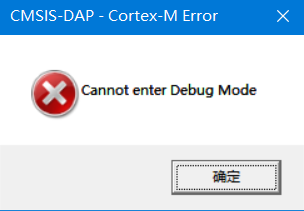
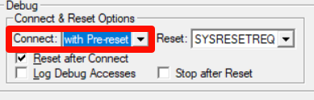

# Keil中使用DAPLink常见问题

## 说明

本说明适用于所有DAPLink。

## RDDI-DAP Error

大多数情况下是通讯不稳定导致的，线太长或速度太快导致的干扰，适当将下载速度降低、换优质杜邦线等。

## SWD/JTAG Communication Failure

此问题是调试器无法发现目标板，检查连接线是否损坏、连接是否太长、目标板是否供电、适当降低下载速度等。

## Cannot enter Debug Mode

可能造成此问题的原因：

- 芯片进入低功耗模式，尝试将Connect改为`with-Pre reset`或`under reset`（注：部分芯片可能支持under-reset这个方式）
    - 、
- 通讯链接不稳定，尝试降低烧录速度
- 可能是芯片一直处于复位状态，检查硬件RESET的电平电压是否正常

## JTAG模式`JTAG Device Chain Error`错误

可能造成此问题的原因：

- 芯片内的程序把JTAG禁用了，尝试使用`with-Pre reset`或`under reset`进行连接
- 目标板被意外切换为了SWD模式导致JTAG无法切换回来了，尝试将目标板断电并重新上电