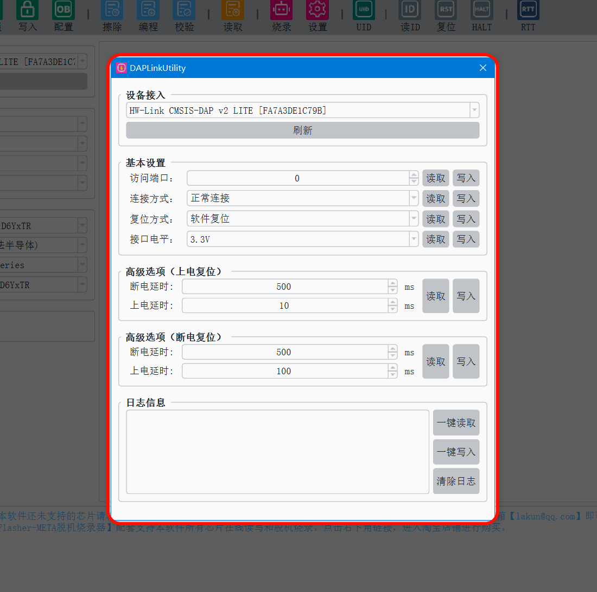

# 个性化硬件设置

## 说明

本说明适用于本店以下产品：

- EasyFlasher-META脱机烧录器
- EasyFlasher-MINI脱机烧录器
- EasyFlasher-LITE脱机烧录器
- HWLink CMSIS-DAP LITE
- HWLink CMSIS-DAP META

## 描述

运行DAPLinkUtility上位机，**菜单->设置->硬件设置**。

### 功能描述

- **访问端口**
    - AP（Debug Access Port）访问端口，绝大多数都为0。可通过keil软件的AP选项确定。如下图所示。
    - 
- **连接方式**
    - 正常连接：无操作。
    - 断电复位：在连接芯片前自动瞬间断电再上电一次，断上电延时时间由高级选项（上电复位）的延时时间决定。**（此功能很有用，当芯片SWCLK、SWDIO、RESET都被程序占用时，配置为上电复位后，可在Keil中二次烧录程序）**
- **复位方式**
    - 软件复位：使用Keil烧录完程序后，自动执行一次软件复位使程序运行，无需接硬件RESET线。
    - 硬件复位：使用Keil烧录完程序后，自动执行一次硬件复位使程序运行。
    - 断电复位：使用Keil烧录完程序后，自动执行一次断上电复位，断上电延时时间由高级选项（断电复位）的延时时间决定。
- **接口电平**
    - 用于调节电平电压

### 电压调节

| 产品/功能 | EasyFlasher-META | EasyFlasher-MINI | EasyFlasher-LITE | EasyFlasher-MINI | HWLink CMSIS-DAP LITE | HWLink CMSIS-DAP META |
| :------: | :------: | :------: | :------: | :------: | :------: | :------: |
| 电压调节 | 0/1.8/3.3/5V  | 0/1.8/3.3/5V | 0/1.8/3.3/5V | 0/1.8/3.3/5V  | 0/3.3/5V | 0/3.3/5V | 