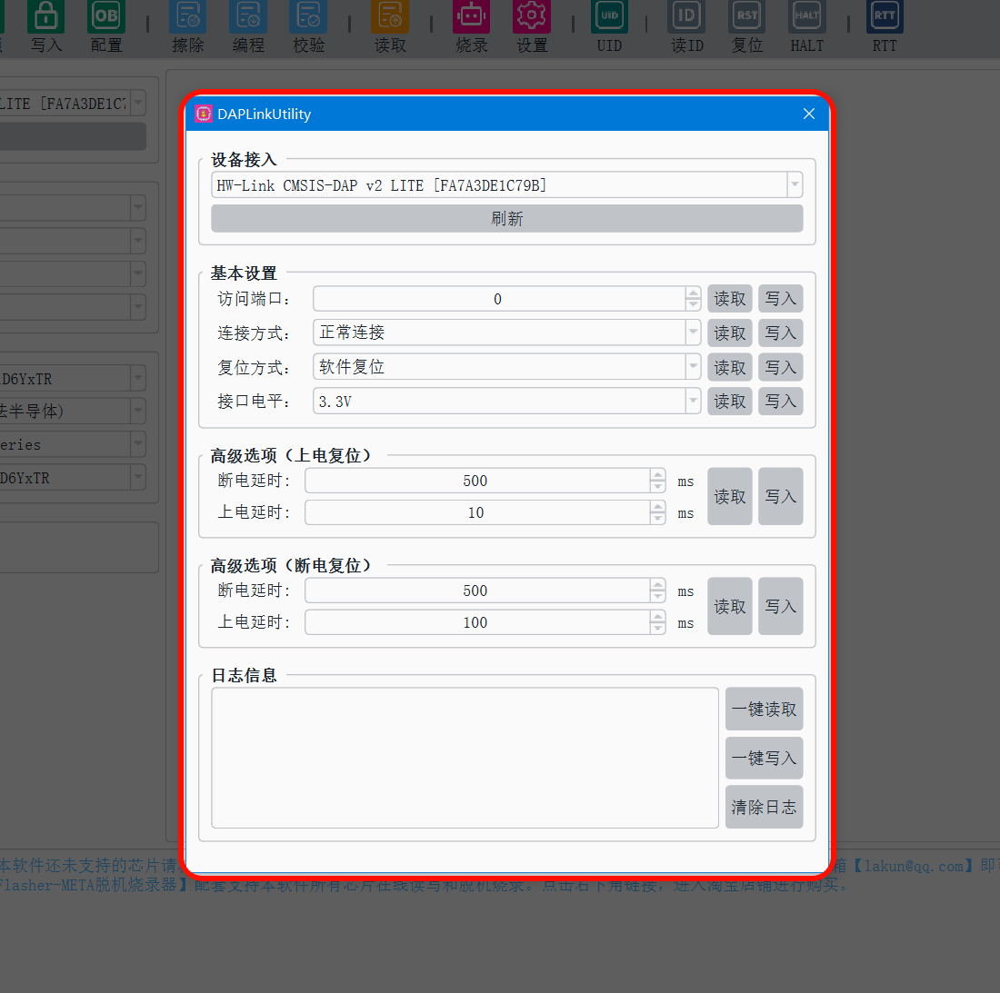
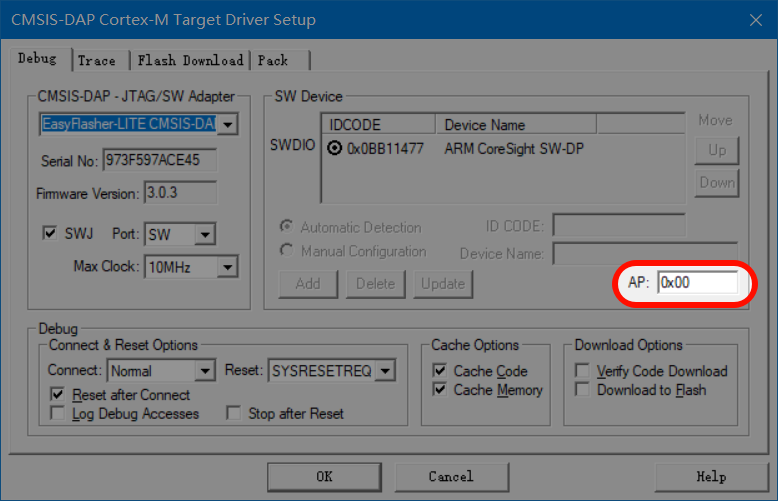

# 个性化硬件设置

## 说明

**电压调节功能硬件支持情况如下表：**

|      产品名称      |   电平电压调节   | 备注  |
| :----------------: | :--------------: | :---: |
|  EasyFlasher-META  |   0/1.8/3.3/5V   |       |
|  EasyFlasher-COOL  |   0/1.8/3.3/5V   |       |
|  EasyFlasher-LITE  |   0/1.8/3.3/5V   |       |
|  EasyFlasher-MINI  |   0/1.8/3.3/5V   |       |
|      HW-Link       |     0/3.3/5V     |       |
| AK-LinkW CMSIS-DAP | 不可调(固定3.3V) |       |

## 描述

运行DAPLinkUtility上位机，**菜单->设置->硬件设置**。

### 功能描述

- **访问端口**
    - AP（Debug Access Port）访问端口，绝大多数都为0。可通过keil软件的AP选项确定。如下图所示。
    - 
- **连接方式**
    - 正常连接：无操作。
    - 断电复位：在连接芯片前自动瞬间断电再上电一次，断上电延时时间由高级选项（上电复位）的延时时间决定。**（此功能很有用，当芯片SWCLK、SWDIO、RESET都被程序占用时，配置为上电复位后，可在Keil中二次烧录程序）**
- **复位方式**
    - 软件复位：使用Keil烧录完程序后，自动执行一次软件复位使程序运行，无需接硬件RESET线。
    - 硬件复位：使用Keil烧录完程序后，自动执行一次硬件复位使程序运行。
    - 断电复位：使用Keil烧录完程序后，自动执行一次断上电复位，断上电延时时间由高级选项（断电复位）的延时时间决定。
    - 禁用复位：ARM官方原版DAPLink固件默认行为。（*注：使用金用复位时，当使用Keil下载完程序后，程序并不会运行，需要手动复位或者给板子重新上电。*）
- **接口电平**
    - 用于调节电平电压

